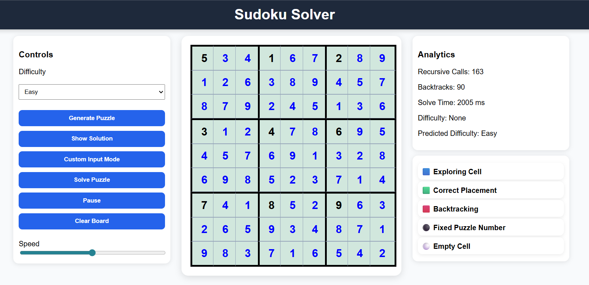

# Sudoku Visualizer

An interactive Sudoku Solver and Visualizer built using HTML, CSS and JavaScript.

## Features

* Generate Easy, Medium and Hard Sudoku puzzles
* Custom Sudoku input mode
* Animated Backtracking Visualization
* Pause / Resume solving
* Adjustable solving speed
* Instant solution generation
* Difficulty prediction
* Real-time analytics

  * Recursive Calls
  * Backtracks
  * Solve Time

## Technologies Used

* HTML
* CSS
* JavaScript

## Algorithms

* Backtracking
* Constraint Validation

## Preview

